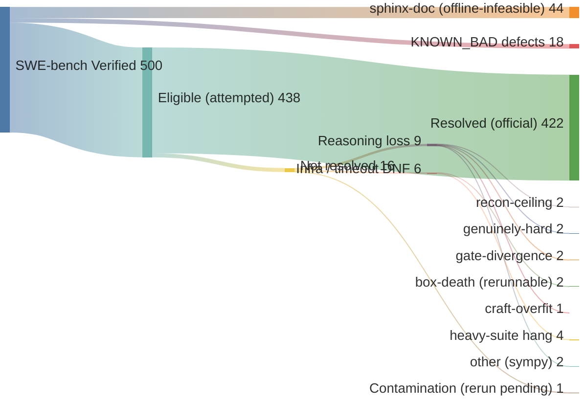

# swebench-verified

A three-stage agent pipeline for SWE-bench Verified, built to be re-run and inspected by skeptics. The point of this repo is not the score. It is that you can clone it, run the exact procedure on the exact skills, and check the artifacts against your own grading.

> ## ⚠️ Contamination disclaimer — read this before the number
>
> **SWE-bench Verified is training-data contaminated for every modern model, including the ones used here.** Claude Sonnet generates and codex (GPT-5.5) filters; both training cutoffs postdate the Verified instances. This is a **leaderboard / capability configuration, not a contamination-clean science claim.**
>
> - Contamination is a property of the *benchmark*, shared by all leaderboard entries — so any score here is a fair entry on the same terms as everyone else, and **nothing more**. It is not evidence that the method causes the result.
> - **Isolating the method** as the cause requires a separate clean-room ablation: post-cutoff instances (SWE-rebench), with-vs-without the pipeline on one fixed model. This repo does **not** make that claim. What it demonstrates is that the pipeline runs end-to-end and produces correct, official-grader-verified patches.
> - The honest unit is a **win count with an explicit denominator** (`KNOWN_BAD.md` exclusions committed), not a "solve rate" you should read as model capability.
>
> **[`LIMITATIONS.md`](LIMITATIONS.md) is the full, unhedged list.** Read it before drawing any conclusion.

## Where the numbers come from (start at 500)

Every one of the 500 SWE-bench Verified instances flows to a visible terminal below — nothing is
silently dropped. **Resolved: 422 / 438 eligible (~96%); 422 / 500 full set (~84%).** The gap from 500
is 44 sphinx-doc (tox-based, can't run airgapped) + 18 documented defects (`KNOWN_BAD.md`) — not
cherry-picking. Counts are re-derivable: the eligible/excluded split from the dataset + `KNOWN_BAD.md`,
the resolved count from committed `official_eval/summary.json` files (`driver/scoreboard.py`).



The 16 not-won, by name (audit them against `results/`): **reasoning (9, not rerun — genuine no-solve)**
django-11734, django-14351 (recon-ceiling), astropy-13398, django-16263 (genuinely-hard), django-14170,
pytest-5787 (gate-divergence), sympy-13091 (craft-overfit), sympy-20438, sympy-17139; **infra/timeout
(6)** django-14404, django-15563 (box-death), django-15957, matplotlib-25311, sympy-19040, sympy-13878
(heavy-suite stage-hang); **contamination (1)** django-15987 (serialization, fix pending re-grade). Only
external/infra faults are eligible for rerun — a reasoning loss stays a loss.

## What it is

Three skills, run as separate `claude --print` invocations, chained by a driver:

- **recon** (read-only): reproduce the failing test, localize the root cause, emit a structured handoff. Single diagnostician.
- **craft** (implementation): draft the patch from the handoff, have a **codex** subagent challenge it (codex generates nothing; it filters), apply, and loop against the test gate until the FAIL_TO_PASS tests pass.
- **audit** (verification): run the full suite, classify each failure against a captured fail-on-base baseline, emit a verdict (`RESOLVED` / `NOT_RESOLVED` / `PARTIAL`) and a re-entry route.

The driver wraps these in an outer loop (max 3): a non-RESOLVED audit routes back to recon (wrong diagnosis) or craft (over-broad fix that regressed something). The system under test is an offline Docker container; the only ground truth is the test gate, never the model's own say-so.

The skills in `skills/` are **frozen independent copies** — a pinned snapshot of the exact recon/craft/audit text that produced the Verified run (422/438). They were hardlinked to the canonical authoring copies during the campaign; now that the eligible pool is exhausted the link is broken, so ongoing edits to the canonical copies (e.g. the SWE-bench Pro port) do not mutate this frozen artifact. `driver/link_skills.sh` is retired for this repo — do not re-run it. A clone gets these real files regardless.

## Recordkeeping (how the honesty is enforced)

The commit history is the audit trail of the method, and it is **append-only by policy**: no force-push, no rebase that drops a losing-run commit, no amending to tidy a failure out of view. A skeptic can replay the whole loop from the log — where the artifact failed, the general fix, the clean re-run — and a quietly-removed loss would show up as rewritten history. Concretely:

- **Every run is committed, wins and losses** (`results/<id>/<run>/`), with the official grader report. Re-runs add new timestamped run dirs; prior losing runs are never deleted or overwritten.
- **`SCOREBOARD.md` is regenerated, but its source isn't.** The per-run `official_eval/summary.json` files only accumulate; the scoreboard is derived from them.
- **Method changes are their own legible diffs.** A reader judges each change for generality (instance-blind) vs a smuggled instance prior.
- **Frozen artifact versions are git-tagged.** The deliverable is a single tagged version run from scratch on the whole target; checking out the tag shows exactly the code that produced those runs. The cross-version history is the development record, not the deliverable.

## What counts as a win

A win is a **passing attestation from the official `swebench.harness.run_evaluation` grader** — nothing else. Not our gate, not the agent's `RESOLVED` claim, not "it would have passed without the infra hiccup." No official attestation, no win. `SCOREBOARD.md` is generated by `driver/scoreboard.py` from the committed `official_eval/summary.json` files, so the count is re-derivable, not asserted. See **[`SCOREBOARD.md`](SCOREBOARD.md)** for the live count (re-derived from the committed `summary.json` files — trust it over any number quoted in prose, which drifts). The scoreboard is a win count with an explicit denominator, not a solve rate, and the contamination disclaimer above governs how to read it.

## Exclusions

The contamination disclaimer is at the top of this README; `LIMITATIONS.md` carries the full, unhedged list (our gate is not the official grader, model output is stochastic, codex can be wrong, hardlinks can drift, AWS/amd64-specific infra). This section covers one more honesty lever:

**Exclusions are explicit.** `KNOWN_BAD.md` is the list of SWE-bench instances with broken Docker envs, flaky tests, gold patches that fail to grade, or weak test coverage (sourced from SWE-bench issues and the UTBoost paper). Every batch is filtered against it before running, so any reported solve rate has an honest denominator. The exclusion is committed, not hidden.

## Result so far

One instance, `pallets__flask-5014` ("require a non-empty Blueprint name"). Artifacts live under `results/pallets__flask-5014/<run-id>/`, one directory and one git commit per run.

- **Official verdict: RESOLVED.** Graded by the official `swebench.harness.run_evaluation`, not by us. See `results/.../official_eval/report.json` (`"resolved_ids": ["pallets__flask-5014"]`, ✓=1) and `official_eval/official_test_output.txt` (the harness's own test log). This is the verdict that counts; our gate below is only the agent's stopping signal.
- Patch (`results/.../patch.diff`): a 3-line guard in `src/flask/blueprints.py`. recon 90s, craft 182s, audit 50s, first pass.
- Our gate agreed independently: the driver re-ran the suite itself (`driver_f2p_pass: true`) and saved the raw output (`passing_tests_our_gate.txt`, `60 passed`). Verdict is not the agent's say-so.
- The codex volley **demonstrably fired** (not narrated by the agent). See `codex_volley_proof.txt`, verbatim from codex's own session log: codex caught that `if not name` is broader than the failing case (it would also catch `None/False/0/[]` and pre-empt the existing `TypeError` path) and recommended `if name == ""`. The agent folded it in.

### batch_001 — 15 instances, 5 boxes in parallel

A second run: 15 Verified instances (filtered against `KNOWN_BAD.md`, pytest-based, across scikit-learn / pytest / astropy / pylint / requests / seaborn), sharded 3-per-box across 5 EC2 boxes.

- **Official verdict: 15/15 RESOLVED.** Per-instance reports + the harness's own test logs are committed under each `results/<id>/<run-id>/official_eval/`. One git commit per run.
- **The outer loop fired and the official grader caught an audit error.** On `psf__requests-2931`, our internal audit flagged a PASS_TO_PASS regression and re-entered the loop (craft narrow-mode, depths 0→1→2, then budget halt), ending NOT_RESOLVED on *our* gate. The official grader resolves it: the patch was correct; audit misclassified a flaky/pre-existing P2P as a regression. Our gate said 14/15; the truth is 15/15. This is exactly why the third-party grader is the authority and our gate is not — and it is committed evidence, not a claim. (Follow-ups: a no-progress routing escalation, now in the driver, re-diagnoses instead of grinding a stuck regression; tightening audit's flaky/pre-existing detection is open.)

### batch_002 — 15 more, 5 boxes

- **Official: 14/15 RESOLVED.** The one miss (`pydata__xarray-6599`) is a craft **timeout** (3600s, no patch captured) — an honest no-solve, not a wrong answer. Recorded as unresolved.
- Two driver false-negatives the official grader overturned: `astropy-14369` (driver `verify_gate` reported `f2p=False`) and `pytest-5809` (audit emitted no parseable verdict) both graded RESOLVED. The pytest-specific `verify_gate` parser undercounts; the official harness is the truth. Two oversized patches (astropy-14598 ~104KB, -14369 ~23KB) also resolved.

### batch_003 — the meaningful one (random, difficulty-stratified, Django-heavy)

First batch drawn as a **random difficulty-stratified sample** (seed=3) across all repos minus KNOWN_BAD/done/sphinx-tox. It came back representative of Verified's true distribution: 11 Django, 2 sympy, 2 matplotlib (13/15 non-pytest, validated beforehand via a smoke run).

- **Official: 12/15 RESOLVED**, 0 graded-failures, 3 empty no-patches.
- **2 of the 3 misses are infra, not capability.** `django-11206` and `sympy-16766` produced empty patches — but both *resolved in isolation* during the pre-batch smoke run. Here they shared box1 with matplotlib-23299 (multi-GB image, slow suite), which starved them (timeout/contention). Lesson: don't co-locate a heavy repo with others. Only `django-16256` is an unexplained genuine no-solve.
- The three oversized patches (matplotlib-26113 341KB, django-15380 208KB, django-13315 60KB) all resolved despite a `capture_patch` bug that swept generated test artifacts into the diff (open fix).

So on the hard, representative slice: 12/15 official, ~2 of the misses fixable infra. This is the first number that estimates anything, and it is appropriately lower and messier than the easy batches.

**Totals (kept separate on purpose):** easy-biased batches 30/31; random hard slice 12/15. Do not collapse these into one rate — they are different samples (see `LIMITATIONS.md`). None of it is the clean-room ablation that would isolate the *method*.

## Run it yourself

Prerequisites:
- An x86-64 Linux Docker host (the SWE-bench eval images are linux/amd64). The provided `driver/provision.sh` spins up an AWS EC2 box with a self-terminating watchdog; any amd64 Docker host works.
- `claude` CLI (Anthropic) authenticated, and `codex` CLI (OpenAI) authenticated, both on the machine that runs the driver. The models run on the driver host; the container is offline.
- Python with `swebench` and `datasets` (`pip install -r requirements.txt`).

Steps:
```bash
# 1. Build a task JSON for any Verified instance
python driver/make_task.py pallets__flask-5014 tasks/pallets__flask-5014.json

# 2. Provision an offline-capable Docker box (or point at your own)
bash driver/provision.sh          # writes /tmp/v4smoke.env (KEY, PUBIP, ...)

# 3. Run the pipeline
python driver/rung4_driver.py /tmp/v4smoke.env tasks/pallets__flask-5014.json pallets__flask-5014

# 4. Inspect: ledger, patch, hypothesis graph land in /tmp/swebench-abduction/
```

Grade the captured patch with the **official** SWE-bench harness (do not trust this repo's gate as the grader; the gate is the agent's stopping signal, the official harness is the verdict):
```bash
python -m swebench.harness.run_evaluation \
  --dataset_name princeton-nlp/SWE-bench_Verified \
  --predictions_path <patches.jsonl> --run_id check
```

See `PROCEDURE.md` for the full step-by-step and `WORKLOG.md` for the build history.

## Layout

```
skills/{recon,craft,audit}/skill.md   the three skills (frozen snapshot; formerly hardlinked)
driver/rung4_driver.py                the orchestrator (recon -> craft -> audit + outer loop)
driver/make_task.py                   builds a task JSON from any Verified instance id
driver/provision.sh                   EC2 provisioning with self-terminating watchdog
driver/link_skills.sh                 (retired) re-established skill hardlinks during the campaign
tasks/                                generated task JSONs
results/<instance>/                   ledger, patch, hypothesis graph, agent logs, codex proof
```

## License

GPL-3.0 (copyleft). See `LICENSE`. If you build on the method, share back.
