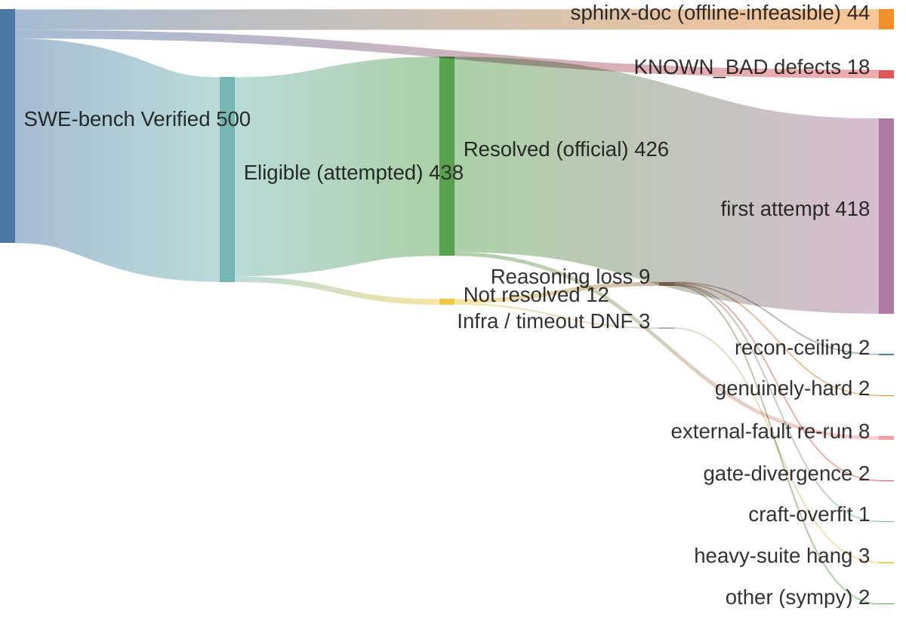

# swebench-verified

A three-stage agent pipeline for SWE-bench Verified, built to be re-run and inspected by skeptics. The point of this repo is not the score. It is that you can clone it, run the exact procedure on the exact skills, and check the artifacts against your own grading.

> **One repo per benchmark.** This is the **Verified** run. The SWE-bench **Pro** run — and its port plan, goal predicate, and validation design (`PRO_PORT.md`) — lives in its own repo, [`swebench-pro`](https://github.com/kimjune01/swebench-pro). Separate repos so each run's artifacts and number stand alone, rather than hiding behind branches.

> ## ⚠️ Contamination disclaimer — read this before the number
>
> **SWE-bench Verified is training-data contaminated for every modern model, including the ones used here.** Claude Sonnet generates and codex (GPT-5.5) filters; both training cutoffs postdate the Verified instances. This is a **leaderboard / capability configuration, not a contamination-clean science claim.**
>
> - Contamination is a property of the *benchmark*, shared by all leaderboard entries — so any score here is a fair entry on the same terms as everyone else, and **nothing more**. It is not evidence that the method causes the result.
> - **Isolating the method** as the cause requires a separate clean-room ablation: post-cutoff instances (SWE-rebench), with-vs-without the pipeline on one fixed model. This repo does **not** make that claim. What it demonstrates is that the pipeline runs end-to-end and produces correct, official-grader-verified patches.
> - The honest unit is a **win count with an explicit denominator** (`KNOWN_BAD.md` exclusions committed), not a "solve rate" you should read as model capability.
>
> **[`LIMITATIONS.md`](LIMITATIONS.md) is the full, unhedged list.** Read it before drawing any conclusion.

## Where the numbers come from (start at 500)

Every one of the 500 SWE-bench Verified instances flows to a visible terminal below — nothing is
silently dropped. **Resolved: 426 / 438 eligible (~97%); 426 / 500 full set (~85%).** Of the 426, 418
were first-attempt and 8 won only on a re-run — and every re-run was an **external-fault correction**
(box-death, a serialization bug since fixed, co-tenant contention), never a re-roll of a reasoning loss;
the original losing runs stay in history. The gap from 500 is 44 sphinx-doc (tox-based, can't run
airgapped) + 18 documented defects (`KNOWN_BAD.md`) — not cherry-picking. Counts are re-derivable: the
eligible/excluded split from the dataset + `KNOWN_BAD.md`, the resolved count from committed
`official_eval/summary.json` files (`driver/scoreboard.py`).



The 12 not-won, by name (audit them against `results/`): **reasoning (9, not rerun — genuine no-solve)**
django-11734, django-14351 (recon-ceiling), astropy-13398, django-16263 (genuinely-hard), django-14170,
pytest-5787 (gate-divergence), sympy-13091 (craft-overfit), sympy-20438, sympy-17139; **infra/timeout
(3)** django-15957, matplotlib-25311, sympy-19040 (heavy-suite stage-hang, await a general stage-cap fix
— not re-rolled). The 4 external-fault losses (django-15563/14404 box-death, django-15987 serialization,
sympy-13878 contention) were corrected by re-run and now resolve; their original losing runs remain in
history. Only external/infra faults are eligible for rerun — a reasoning loss stays a loss.

## What it is

Three skills, run as separate `claude --print` invocations, chained by a driver:

- **recon** (read-only): reproduce the failing test, localize the root cause, emit a structured handoff. Single diagnostician.
- **craft** (implementation): draft the patch from the handoff, have a **codex** subagent challenge it (codex generates nothing; it filters), apply, and loop against the test gate until the FAIL_TO_PASS tests pass.
- **audit** (verification): run the full suite, classify each failure against a captured fail-on-base baseline, emit a verdict (`RESOLVED` / `NOT_RESOLVED` / `PARTIAL`) and a re-entry route.

The driver wraps these in an outer loop (max 3): a non-RESOLVED audit routes back to recon (wrong diagnosis) or craft (over-broad fix that regressed something). The system under test is an offline Docker container; the only ground truth is the test gate, never the model's own say-so.

The skills in `skills/` are **frozen independent copies** — a pinned snapshot of the exact recon/craft/audit text that produced the Verified run (426/438). They were hardlinked to the canonical authoring copies during the campaign; now that the eligible pool is exhausted the link is broken, so ongoing edits to the canonical copies (e.g. the SWE-bench Pro port) do not mutate this frozen artifact. `driver/link_skills.sh` is retired for this repo — do not re-run it. A clone gets these real files regardless.

## Recordkeeping (how the honesty is enforced)

The commit history is the audit trail of the method, and it is **append-only by policy**: no force-push, no rebase that drops a losing-run commit, no amending to tidy a failure out of view. A skeptic can replay the whole loop from the log — where the artifact failed, the general fix, the clean re-run — and a quietly-removed loss would show up as rewritten history. Concretely:

- **Every run is committed, wins and losses** (`results/<id>/<run>/`), with the official grader report. Re-runs add new timestamped run dirs; prior losing runs are never deleted or overwritten.
- **`SCOREBOARD.md` is regenerated, but its source isn't.** The per-run `official_eval/summary.json` files only accumulate; the scoreboard is derived from them.
- **Method changes are their own legible diffs.** A reader judges each change for generality (instance-blind) vs a smuggled instance prior.
- **Frozen artifact versions are git-tagged.** The deliverable is a single tagged version run from scratch on the whole target; checking out the tag shows exactly the code that produced those runs. The cross-version history is the development record, not the deliverable.

## What counts as a win

A win is a **passing attestation from the official `swebench.harness.run_evaluation` grader** — nothing else. Not our gate, not the agent's `RESOLVED` claim, not "it would have passed without the infra hiccup." [`SCOREBOARD.md`](SCOREBOARD.md) is the live count, re-derived by `driver/scoreboard.py` from the committed `official_eval/summary.json` files — trust it over any number in prose, which drifts.

## Exclusions

[`KNOWN_BAD.md`](KNOWN_BAD.md) lists the SWE-bench instances with broken Docker envs, flaky tests, gold patches that fail to grade, or weak coverage (sourced from SWE-bench issues and the UTBoost paper). Every batch is filtered against it before running and the exclusion is committed, so the denominator is honest. [`LIMITATIONS.md`](LIMITATIONS.md) carries the full, unhedged list of everything else.

## Run it yourself

Prerequisites:
- An x86-64 Linux Docker host (the SWE-bench eval images are linux/amd64). The provided `driver/provision.sh` spins up an AWS EC2 box with a self-terminating watchdog; any amd64 Docker host works.
- `claude` CLI (Anthropic) authenticated, and `codex` CLI (OpenAI) authenticated, both on the machine that runs the driver. The models run on the driver host; the container is offline.
- Python with `swebench` and `datasets` (`pip install -r requirements.txt`).

Steps:
```bash
# 1. Build a task JSON for any Verified instance
python driver/make_task.py pallets__flask-5014 tasks/pallets__flask-5014.json

# 2. Provision an offline-capable Docker box (or point at your own)
bash driver/provision.sh          # writes /tmp/v4smoke.env (KEY, PUBIP, ...)

# 3. Run the pipeline
python driver/rung4_driver.py /tmp/v4smoke.env tasks/pallets__flask-5014.json pallets__flask-5014

# 4. Inspect: ledger, patch, hypothesis graph land in /tmp/swebench-abduction/
```

Grade the captured patch with the **official** SWE-bench harness (do not trust this repo's gate as the grader; the gate is the agent's stopping signal, the official harness is the verdict):
```bash
python -m swebench.harness.run_evaluation \
  --dataset_name princeton-nlp/SWE-bench_Verified \
  --predictions_path <patches.jsonl> --run_id check
```

See `PROCEDURE.md` for the full step-by-step and `WORKLOG.md` for the build history.

## Layout

```
skills/{recon,craft,audit}/skill.md   the three skills (frozen snapshot; formerly hardlinked)
driver/rung4_driver.py                the orchestrator (recon -> craft -> audit + outer loop)
driver/make_task.py                   builds a task JSON from any Verified instance id
driver/provision.sh                   EC2 provisioning with self-terminating watchdog
driver/link_skills.sh                 (retired) re-established skill hardlinks during the campaign
tasks/                                generated task JSONs
results/<instance>/                   ledger, patch, hypothesis graph, agent logs, codex proof
```

## License

GPL-3.0 (copyleft). See `LICENSE`. If you build on the method, share back.
